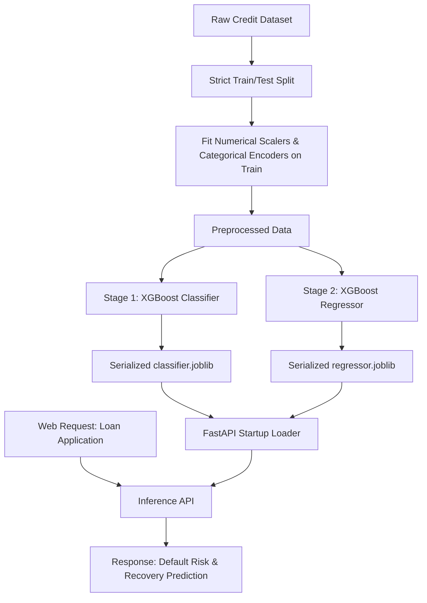

# SmartRecovery: Dual-Stage Fintech Credit Risk & Recovery Engine

SmartRecovery is a production-grade credit evaluation and loan recovery forecasting system. It uses a **dual-stage Machine Learning pipeline** to evaluate loan applicants, predict the probability of default, and forecast the expected asset recovery rate if a default occurs.

The system is served via a low-latency FastAPI backend and features a **luxury Black & Gold glassmorphic dashboard** with real-time prediction forms and model performance analytics.

---

## 🏗️ System Architecture & Data Flow

SmartRecovery utilizes a modular OOP clean architecture dividing concerns between data science pipeline generation and production inference serving.



### The Dual-Stage Prediction Pipeline
1. **Stage 1: Classification (`is_default`)**
   - Inputs the applicant's credit score (FICO), annual income, requested loan amount, interest rate, debt-to-income (DTI), employment history, and home ownership status.
   - Outputs the **probability of default** and categorizes the application into a **Risk Tier** (Low, Medium, High, Critical).
2. **Stage 2: Regression (`recovery_rate`)**
   - Conditioned on default, predicts the continuous **expected recovery rate** (0% to 100%) indicating how much principal can be recovered through collections or collateral.
   - Calculates the net **expected recovery amount** in USD.

---

## ⚡ Machine Learning Best Practices Implemented

Following strict industry standards to prevent data leakage and ensure model robustness:
- **Strict Pipeline Ordering**: Feature engineering, numerical scaling, and categorical encoding are fitted **exclusively on the training split** and applied independently to the test split.
- **Model Comparison**:
  - **Classification**: Trains and compares Logistic Regression, Random Forest, and XGBoost Classifiers (Evaluating Accuracy, Precision, Recall, F1, and ROC-AUC).
  - **Regression**: Trains and compares Linear Regression, Random Forest, and XGBoost Regressors (Evaluating $R^2$, MAE, and RMSE).
- **Automation**: The synthetic data generator and model training pipeline are executed **during the Docker build phase**, baking the latest serialized model files directly into the final container image for fast startup.

---

## ⚙️ Running Locally

### Prerequisites
- Docker and Docker Compose installed

### Launch the Application (One Command)
```bash
docker-compose up --build
```
This builds the image, runs the ML training script inside the container, saves the serialized models, and spins up the FastAPI server at `http://localhost:8000`.

---

## 🧪 Testing and Coverage

We maintain **87% test coverage** using `pytest` and `pytest-asyncio` on our API endpoints:

```bash
# Set up virtual environment
py -3.13 -m venv .venv
.venv\Scripts\activate

# Install requirements
pip install -r requirements.txt

# Run test suite
pytest --cov=app --cov-report=term-missing tests/
```

### Coverage Output
```
============================= test session starts =============================
platform win32 -- Python 3.13.9, pytest-9.1.1, pluggy-1.6.0
plugins: anyio-4.14.1, asyncio-1.4.0, cov-7.1.0
collected 4 items

tests\test_app.py ....                                                   [100%]

Name          Stmts   Miss  Cover   Missing
-------------------------------------------
app\main.py      83     11    87%   36, 110, 134-135, 137-138, 143-144, 164-165, 176
-------------------------------------------
TOTAL            83     11    87%
======================== 4 passed, 1 warning in 2.63s =========================
```

---

## 🚀 Cloud Deployment Guide

SmartRecovery is fully structured to deploy on **Render** or **Railway** using the baked-in Docker configuration.

### Deploy to Render
1. Create a new **Web Service** on Render.
2. Connect your GitHub repository.
3. Render will automatically read the `render.yaml` blueprint, build the Dockerfile, execute model training, and launch the service live.
4. Enjoy your live link!
